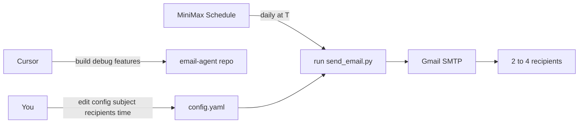

# MiniMax daily Gmail sender (Cursor builds, MiniMax runs)

**Status:** Saved for later implementation  
**Saved:** 2026-07-16

## Overview

Build a small Gmail SMTP email sender plus a MiniMax scheduled-task prompt pack. Cursor is used only to build and iterate; MiniMax runs the daily sends for at least a week.

## Roles

| Role | Who | When tokens are used |
|------|-----|----------------------|
| Builder / task manager | **Cursor** | Planning, coding, new features, debugging |
| Daily executor | **MiniMax Code scheduled task** | Each daily run (MiniMax plan tokens, not Cursor) |
| Mail transport | **Gmail SMTP** | App Password; no LLM tokens |

Cursor does **not** stay online for a week. MiniMax’s scheduled task runs the send job every day.

## What we will build in this repo

New folder (e.g. `email-agent/`) with:

1. **`send_email.py`** — reads config + env secrets, sends one email via Gmail SMTP (`smtplib` + TLS) to 2–4 recipients.
2. **`config.example.yaml`** — template you copy to `config.yaml`:
   - `subject` (you set)
   - `body` (plain text)
   - `recipients` (list of 2–4 addresses)
   - `timezone` / notes for schedule time (actual clock time is set in MiniMax)
3. **`.env.example`** — `GMAIL_ADDRESS`, `GMAIL_APP_PASSWORD` (never commit real secrets).
4. **`requirements.txt`** — minimal deps (`PyYAML` only; stdlib SMTP).
5. **`minimax/SCHEDULED_TASK.md`** — copy-paste instructions for MiniMax Code:
   - Create scheduled task (daily, your time + timezone)
   - Agent steps: load workspace → run `python send_email.py` → report success/failure
   - Keep the prompt short so MiniMax spends few tokens per run
6. **`README.md`** — Gmail App Password setup, local test, MiniMax schedule steps, how to ask Cursor for changes.

## Your one-time Gmail setup (manual)

1. Enable 2FA on the Gmail account.
2. Create a [Google App Password](https://myaccount.google.com/apppasswords).
3. Put address + app password in MiniMax/workspace secrets or a local `.env` that MiniMax can read (not in git).

## Daily run behavior (week+)

- You change **subject / body / recipients** in `config.yaml` whenever you want.
- MiniMax runs once per day at the time you set in its scheduler (e.g. `/schedule ... --repeat daily`).
- Each run: execute the script only — no LLM drafting of email content unless you later ask Cursor to add that feature.

## Token / cost model (build → one week)

### A. Cursor tokens (build + task-manager feedback)

Used only when you chat with Cursor to build or change the system.

| Phase | Rough size | Cursor tokens |
|-------|------------|---------------|
| This plan + first implementation | 1 build session | **Medium** (one PR-sized coding chat) |
| Local test + fix SMTP issues | 0–2 short debug chats | **Low–medium** |
| New feature later (e.g. HTML body, attachments) | per request | **Only when you ask** |
| Pure daily sends for 7 days | — | **~0** (MiniMax runs them, not Cursor) |

Cursor is the task manager: you open a chat like “add CC support” or “SMTP auth failed with this error” — tokens only for those sessions.

### B. MiniMax tokens (daily execution)

| Phase | Rough usage |
|-------|-------------|
| First schedule setup in MiniMax UI | Small one-time prompt |
| Each daily run (tight prompt: “run `python send_email.py`”) | **Low** — mostly tool/shell, little reasoning |
| If you instead ask MiniMax to “compose and send” each day | **Much higher** — avoid this for week-long runs |

For **7 days × 1 send/day** with a script-only prompt: expect on the order of **7 short MiniMax runs**. Exact token counts depend on MiniMax’s plan metering and how verbose the agent is; the script approach keeps it near the minimum.

### C. What does *not* consume LLM tokens

- Gmail SMTP send itself
- Editing `config.yaml`
- Cron-like wake-up inside MiniMax (billing is for the agent run, not idle wait)

### D. Practical budget summary

- **Build once in Cursor** → pay Cursor tokens once (plus later feature/debug chats).
- **Run for a week on MiniMax** → pay MiniMax for ~7 scheduled runs; Cursor stays at zero unless you ask for changes.
- **Cheapest correct design**: MiniMax = scheduler + shell; Python = mail; Cursor = builder.

## Out of scope / constraints

- No temporary/disposable From addresses — sender is your Gmail only.
- Cursor cannot click MiniMax’s UI for you; paste `SCHEDULED_TASK.md` into MiniMax and set the time there.
- Secrets stay in env/secrets, never in the repo.

## Acceptance criteria

- `python send_email.py` sends one test mail from your Gmail to your test recipients.
- MiniMax scheduled task runs the same command daily for ≥7 days without opening Cursor.
- Changing subject/recipients only requires editing `config.yaml` (no code change).
- README documents how to request feature/debug work in Cursor without touching the daily schedule.

## Implementation checklist (when ready to build)

- [ ] Create `email-agent/` with `send_email.py`, `config.example.yaml`, `.env.example`, `requirements.txt`
- [ ] Write `minimax/SCHEDULED_TASK.md` with short daily-run prompt and schedule steps
- [ ] Write `README.md` with Gmail App Password setup, local test, MiniMax schedule, Cursor-as-task-manager + token notes
- [ ] Document smoke-test checklist (dry-run flag optional) before first real MiniMax schedule

## How to resume later

In Cursor, open a chat and say:

> Implement the plan in `.cursor/plans/minimax-gmail-email-agent.md`

Or with MiniMax-M3 selected in Cursor Desktop:

> Build the email agent described in `.cursor/plans/minimax-gmail-email-agent.md`
